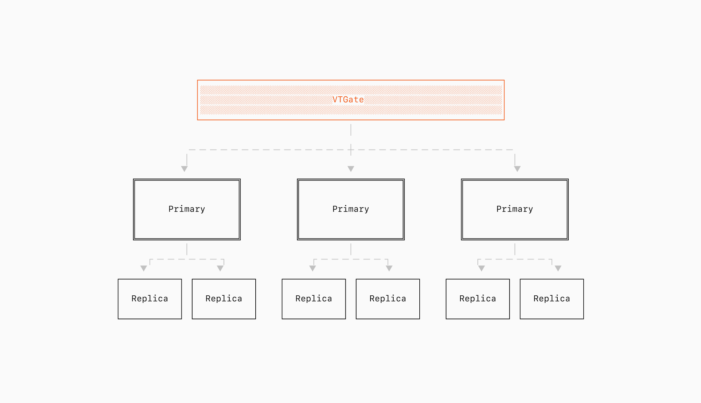

scheduler-pro2 aims to provide a robust, type-safe database client that makes it easy to work with your database while maintaining strong typing throughout your application. We aim to support tooling that:

- Provide a declarative way to define your database schema
- Generate type-safe database client
- Handle database migrations
- Offer powerful query capabilities with full TypeScript support

## Default Configuration

By default, scheduler-pro2 uses [Neon](https://neon.tech) as its database provider and [Prisma](https://prisma.io) as its ORM. However, you can easily switch to other providers if you'd prefer, for example:

- You can use other ORMs like [Drizzle](/migrations/database/drizzle), Kysely or any other type-safe ORM.
- You can use other database providers like [PlanetScale](/migrations/database/planetscale), [Prisma Postgres](/migrations/database/prisma-postgres), [Supabase](/migrations/database/supabase), [EdgeDB](/migrations/database/edgedb), or any other PostgreSQL/MySQL provider.

## Usage

Database and ORM configuration is located in `@repo/database`. You can import this package into any server-side component, like so:

```tsx title="page.tsx {1,4}"
import { database } from '@repo/database'

const Page = async () => {
  const users = await database.user.findMany()

  // Do something with users!
}
```

## Schema Definition

The database schema is defined in `packages/database/prisma/schema.prisma`. This schema file uses Prisma's schema definition language to describe your database tables, relationships, and types.

### Adding a new model

Let's say we want to add a new model called `Post`, describing a blog post. The blog content will be in a JSON format, generated by a library like [Tiptap](https://tiptap.dev/). To do this, we would add the following to your schema:

```prisma title="packages/database/prisma/schema.prisma {1-7}"
model Post {
  id        String   @id @default(cuid())
  title     String
  content   Json
  createdAt DateTime @default(now())
  updatedAt DateTime @updatedAt
}
```

### Deploying changes

To deploy your schema changes, run the following command:

```sh title="Terminal"
pnpm migrate
```

This runs the following commands:

- `npx prisma format` to format the schema file
- `npx prisma generate` to generate the Prisma client
- `npx prisma db push` to push the schema changes to the database

This runs the following commands DEMO:

- `npx prisma migrate dev`
- `npx prisma migrate reset`

## Visual database editor

scheduler-pro2 includes a [visual database editor](/apps/studio) that allows you to view and edit your database records.
