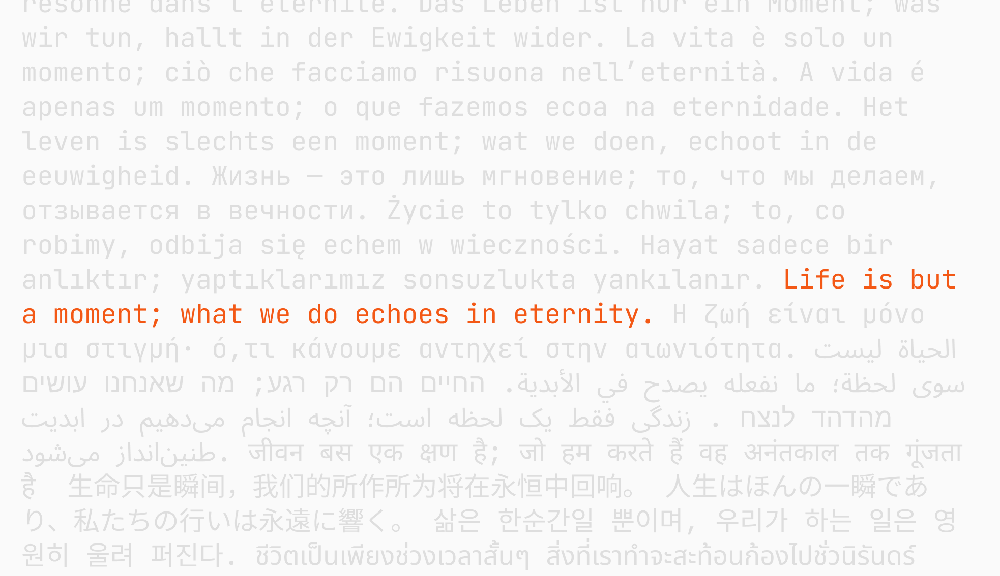
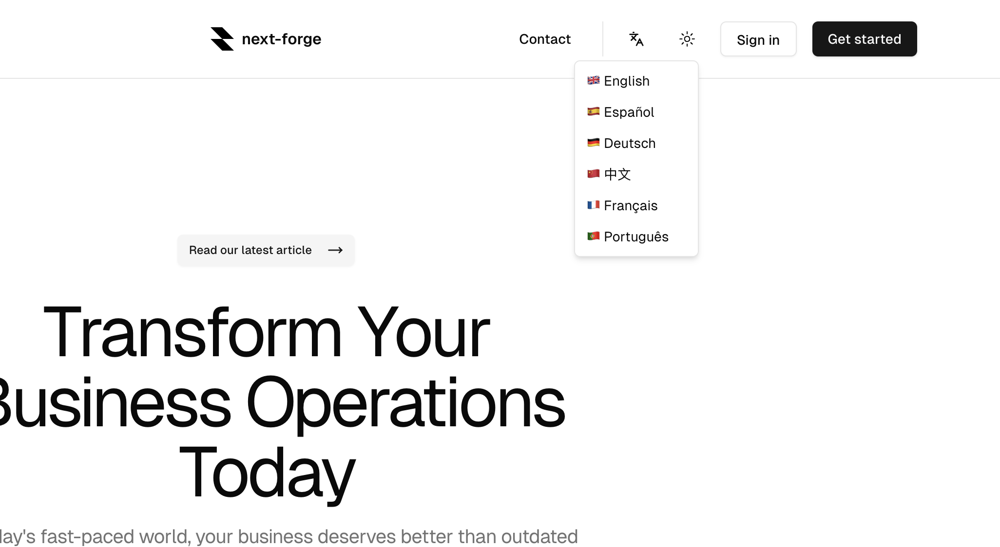

<Authors data={[{
user: {
name: 'Hayden Bleasel',
id: 'haydenbleasel',
},
company: {
name: 'vercel',
id: 'vercel',
},
}, {
user: {
name: 'Pontus Abrahamsson',
id: 'pontusab',
},
company: {
name: 'Languine',
id: 'languine',
}
}]} />



next-forge includes a powerful internationalization package that enables you to add multiple language support to your application with minimal configuration. The package handles language detection, routing, and content management through a dictionary-based approach.

<Tip>
  [Languine](https://dub.sh/0KOndf7) offers 500 translation keys for free. If you need more, you can upgrade to a paid plan with the discount code `nextforge` for 30% off!
</Tip>

## How it works

The internationalization system is built on [Next.js Internationalization](https://nextjs.org/docs/app/building-your-application/routing/internationalization)'s routing system and [Languine](https://dub.sh/0KOndf7)'s translation system.

It's configured by default for the `web` package to:

1. Detect the user's preferred language through browser headers
2. Route users to language-specific paths (e.g., `/en/about`, `/fr/about`)
3. Serve content from language-specific dictionaries

The package handles language detection and matching, ensuring users see content in their preferred language when available.

## Setup

To enable automatic translations, simply create a `.env` file in the `internationalization` package and set the `LANGUINE_PROJECT_ID` environment variable.

```txt title=".env"
LANGUINE_PROJECT_ID="your-project-id"
```

## Configuration

The internationalization package is configured through a `languine.json` file that defines:

- Source locale (e.g., `en`)
- Target locales (e.g., `["es", "de"]`)
- Dictionary file locations

## Dictionary Structure

Dictionaries are TypeScript files that export strongly-typed content for each supported language. The type system ensures consistency across translations:

```ts title="packages/internationalization/dictionaries/[locale].ts"
import type { Dictionary } from '@repo/internationalization'

const dictionary: Dictionary = {}

export default dictionary
```

There is no need to create a dictionary for any non-source locale, as [Languine](https://dub.sh/0KOndf7) will automatically generate the translations for you.

## Usage

### Translating

To translate your application, you can run the following command:

```bash title="Terminal"
pnpm translate
```

This will translate all of the content in your application and save the translations to the `dictionaries` folder.

### Frontend

To use the internationalization package, you need to:

1. Maintain a dictionary for your source locale.
2. Import the dictionary into your application.
3. Use the dictionary to render content.

You can find an example of a dictionary in the `web` package:

```tsx title="apps/web/app/page.tsx"
import { getDictionary } from '@repo/internationalization'

type HomeProps = {
  params: Promise<{
    locale: string
  }>
}

const Home = async ({ params }: HomeProps) => {
  const { locale } = await params
  const dictionary = await getDictionary(locale)

  // ...
}
```

You can change the locale of the application by changing the `locale` parameter in the URL. For example, `https://example.com/en/about` will render the `about` page in English.

We've already configured the `web` package with a language switcher, so you don't need to worry about it.



### Middleware

The internationalization package also includes a middleware component that automatically detects the user's language and routes them to the appropriate language-specific page.

This has already been configured for the `web` package, so you don't need to worry about it.

```tsx title="apps/web/middleware.ts"
import { internationalizationMiddleware } from '@repo/internationalization'

export default internationalizationMiddleware
```
